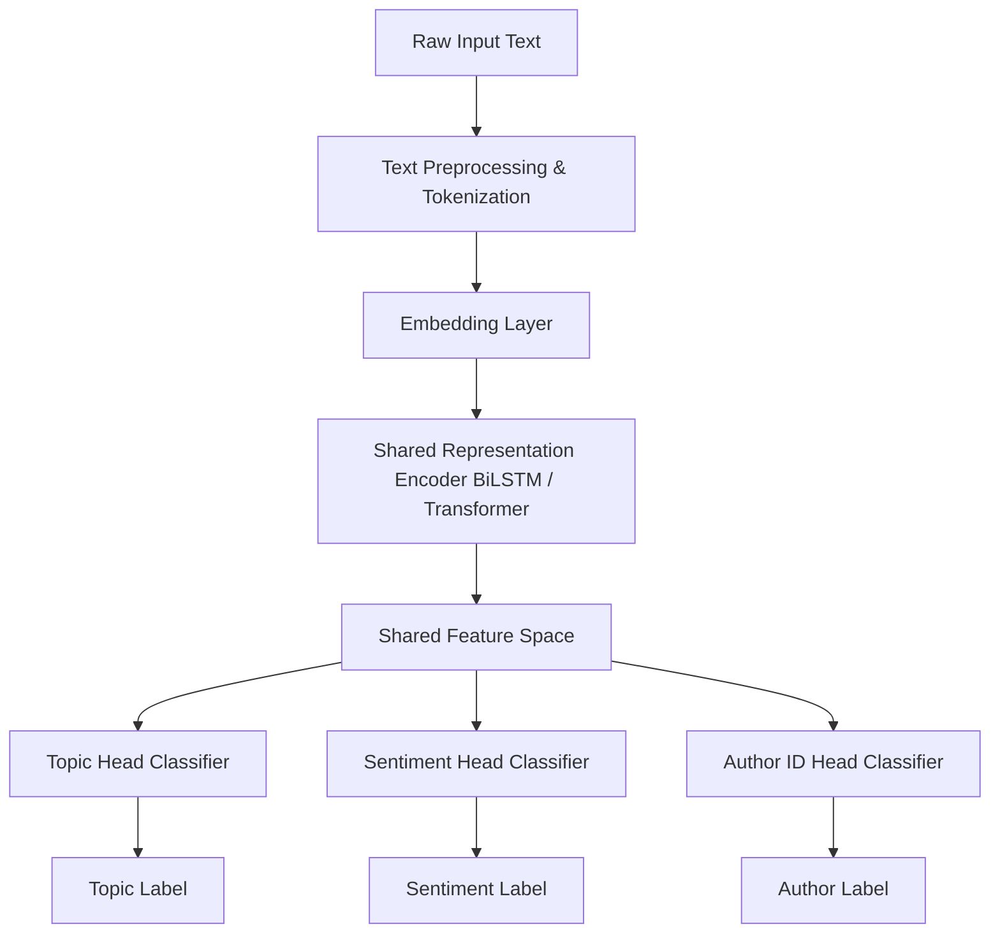

# TriTaskNLP

> Unified Multi-Task Learning framework for Topic Classification, Sentiment Analysis, and Author Identification.

[Repository](https://github.com/SanyogSingh07/TriTaskNLP)

---

## Overview

**TriTaskNLP** is a multi-task Natural Language Processing system that joint-trains three distinct text analysis objectives — **Topic Classification**, **Sentiment Analysis**, and **Author Identification** — within a single neural architecture.

Rather than training isolated task models, TriTaskNLP utilizes a **shared embedding & encoder representation**, allowing a single backbone to extract semantic and stylistic features that generalize across objectives while maintaining task-specific classification heads.

---

## Architecture



### Key Technical Innovations
- **Shared Representation Learning**: Reduces parameters and memory footprint compared to 3 independent models.
- **Weighted Multi-Objective Optimization**: Combines task losses ($\mathcal{L}_{total} = lpha \mathcal{L}_{topic} + eta \mathcal{L}_{sent} + \gamma \mathcal{L}_{author}$) with gradient balancing.
- **Interactive Rich CLI**: Command-line dashboard featuring live prediction, confusion matrix evaluation, and t-SNE / PCA representation plots.

---

## Tech Stack

- **Language**: Python 3.10+
- **Deep Learning**: PyTorch, torchvision
- **NLP & Feature Engineering**: NumPy, Scikit-learn, Matplotlib
- **UI / CLI**: Rich, PyInquirer

---

## Evaluation Ranges

| Task Objective | Typical Accuracy Range |
|:---|:---|
| **Topic Classification** | 92% – 96% |
| **Sentiment Analysis** | 90% – 94% |
| **Author Identification** | 85% – 92% |

---

## Project Structure

```text
TriTaskNLP/
├── main.py                 # Interactive CLI entry point
├── train.py                # Multi-task training engine
├── evaluate.py             # Evaluation and metrics suite
├── cli/                    # Rich CLI interface modules
├── data/                   # Dataset loaders and preprocessors
├── models/                 # PyTorch neural architectures
└── utils/                  # Visualization (t-SNE/PCA) and logging
```

---

## Setup & Execution

```bash
git clone https://github.com/SanyogSingh07/TriTaskNLP.git
cd TriTaskNLP
python -m venv .venv
# Activate venv: Windows: .venv\Scripts\activate | Unix: source .venv/bin/activate
pip install -r requirements.txt
python main.py
```

---

## License

Distributed under the **MIT License**.
