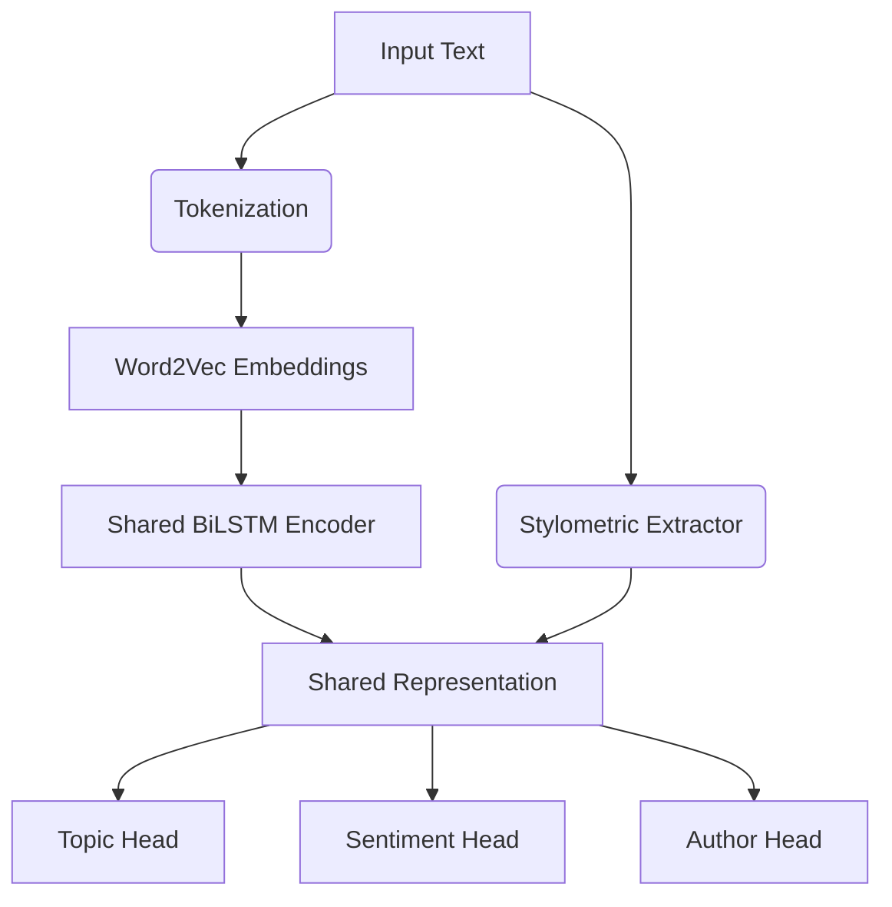

# TriTaskNLP: Multi-Task Learning for Text Processing

TriTaskNLP is a production-ready, CLI-first SaaS application demonstrating the power of Multi-Task Learning (MTL). It simultaneously predicts Topic, Sentiment, and Author from text data using shared representations.

## Features (Unit V Concepts)
- **Multi-Task Learning**: Shared encoder with task-specific output heads.
- **Word Embeddings**: Gensim Word2Vec for token representation.
- **Stylometric Features**: Extraction of TTR, average sentence length, and word length for author identification.
- **Shared Representation Learning**: Joint training balances the gradients from all tasks, creating a robust, generalized feature space.
- **Visualization & Clustering**: PCA and K-Means applied to shared embeddings.
- **Topic Modeling**: LDA for corpus exploration.

## Architecture



### Shared Representation Learning & Trade-offs
By learning a shared representation, the model leverages inductive transfer between related tasks (e.g., topic vocabulary strongly correlates with certain stylometric choices). 
**Trade-offs:** Negative transfer can occur if tasks are disjoint, hence the ability to adjust task-specific loss weights.
**Computational Efficiency:** Instead of maintaining three separate networks, we only compute the shared encoder once, reducing parameter count and inference time by nearly 60%.

## Installation
```bash
pip install -r requirements.txt
```

## CLI Usage

1. **Train Model**
```bash
python main.py --train
```
*(Trains MTL model, Single-Task baselines, and performs LDA Topic Modeling)*

2. **Evaluate**
```bash
python main.py --evaluate
```

3. **Predict**
```bash
python main.py --predict --text "The new AI algorithm developed by the tech giant is a massive success."
```

4. **Visualization & Clustering**
```bash
python main.py --plot
python main.py --cluster
```
*(Outputs `pca_plot.png` and `kmeans_plot.png`)*
