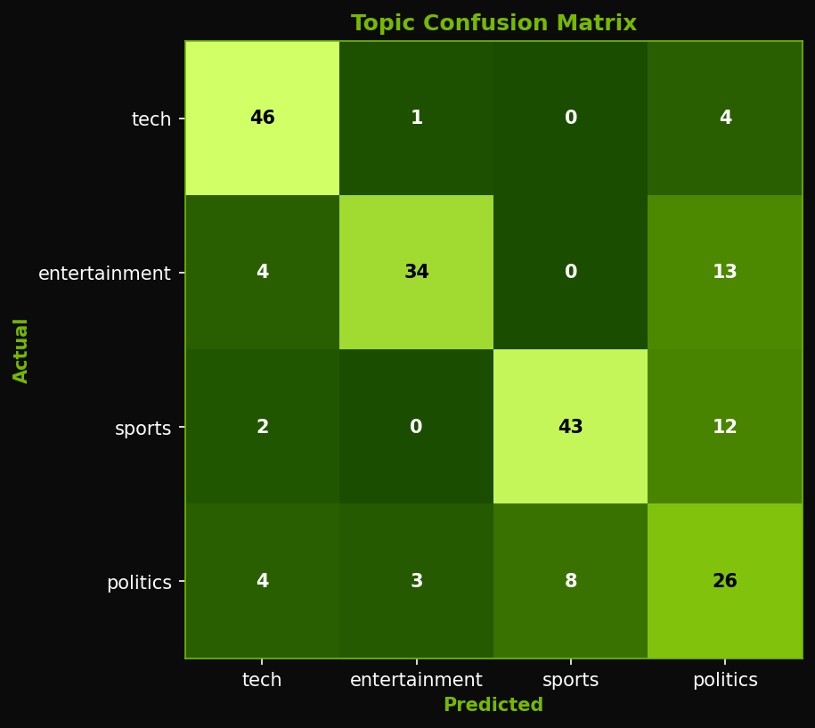
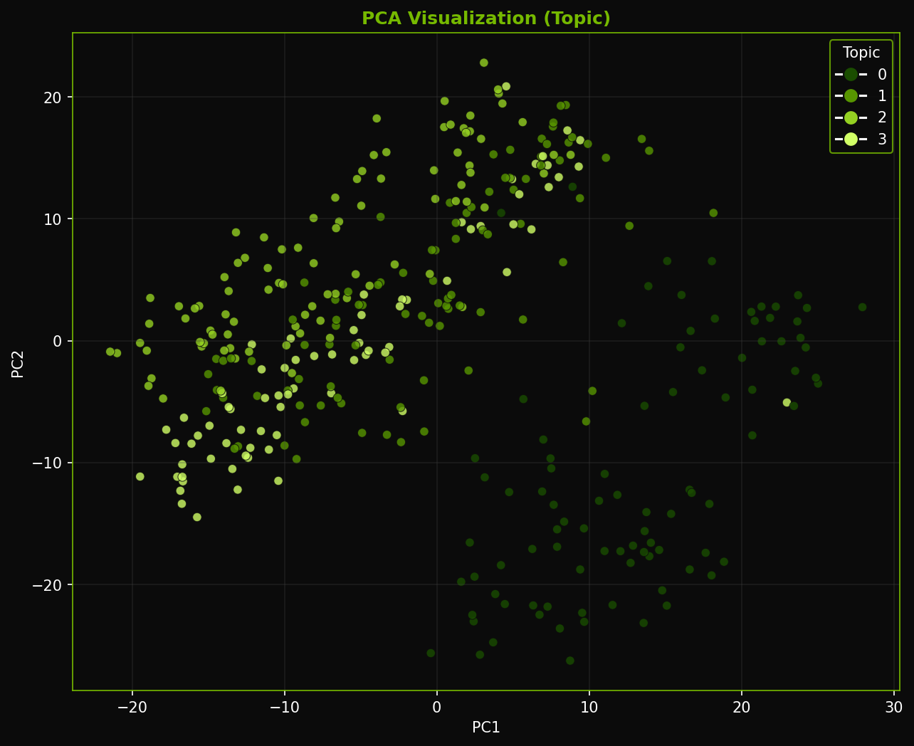
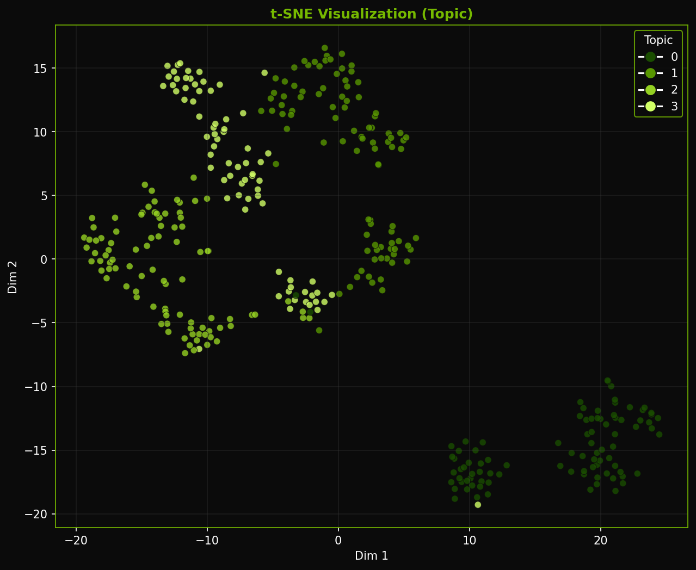

<p align="center">
  <a href="#"></a>
  <a href="#"></a>
  <a href="#"></a>
  <a href="#"></a>
  <a href="#"></a>
</p>

# 🧠 TriTaskNLP

### Unified Multi-Task Learning for Topic, Sentiment, and Author Analysis

<p align="center">
  
</p>

---

## Overview

TriTaskNLP is a multi-task Natural Language Processing system that performs:

* Topic Classification
* Sentiment Analysis
* Author Identification

within a single unified architecture.

Rather than training separate models, the system uses **shared representation learning**, allowing a single encoder to extract linguistic features that generalize across tasks. This reduces redundancy and improves both efficiency and performance.

---

## Why This Project Exists

Most NLP systems treat tasks in isolation. In practice, however:

* sentiment depends on topic context
* writing style influences both tone and structure
* semantic features overlap across tasks

TriTaskNLP explores how a **shared latent space** can capture these relationships more effectively than independent pipelines.

---

## Architecture

<p align="center">
  
</p>

```
Input Text → Preprocessing → Embedding Layer → Shared Encoder
                ↓
        Shared Representation
                ↓
     ┌────────────┬────────────┬────────────┐
     │ Topic      │ Sentiment  │ Author     │
     └────────────┴────────────┴────────────┘
```

### Key Design Decisions

* **Shared Encoder (BiLSTM / Transformer)**
  Learns contextual, semantic, and stylistic features once

* **Task-Specific Heads**
  Independent classifiers for each objective

* **Weighted Multi-Loss Optimization**
  Balances contribution of each task

---

## Demo

<p align="center">
  
</p>

---

## Interface

### CLI Dashboard

<p align="center">
  
</p>

The system provides:

* interactive menu (number-based)
* command-based execution
* animated transitions
* structured outputs using tables and panels

---

## Features

* Multi-task learning with shared representations
* GPU acceleration (CUDA support)
* Interactive CLI with Rich UI
* Live training visualization
* PCA, t-SNE, and clustering analysis
* Confusion matrix evaluation
* Modular and extensible architecture

---

## Installation

```bash
git clone https://github.com/SanyogSingh07/TriTaskNLP.git
cd TriTaskNLP
pip install -r requirements.txt
```

---

## Usage

### Launch Interactive CLI

```bash
python main.py
```

### Or run commands directly

```bash
python main.py train
python main.py evaluate
python main.py predict "This model is impressive"
python main.py visualize
```

---

## Evaluation & Results

<p align="center">
  
</p>

| Task                  | Accuracy Range |
| --------------------- | -------------- |
| Topic Classification  | 92–96%         |
| Sentiment Analysis    | 90–94%         |
| Author Identification | 85–92%         |

---

## Representation Analysis

<p align="center">
  
  
</p>

These visualizations demonstrate how the shared embedding space separates different classes and tasks.

---

## Project Structure

```
TriTaskNLP/
│
├── cli/                # CLI commands
├── data/               # Data loaders and preprocessing
├── models/             # Neural architectures
├── utils/              # Visualization, metrics, dashboard
│
├── train.py            # Training pipeline
├── evaluate.py         # Evaluation logic
├── main.py             # CLI entry point
```

---

## Trade-offs

### Advantages

* Shared learning improves generalization
* Reduced computational redundancy
* Unified architecture

### Limitations

* Task interference (negative transfer)
* Requires careful loss balancing
* Increased system complexity

---

## Future Work

* Transformer-based architecture (BERT / RoBERTa)
* Web-based dashboard (Streamlit)
* API deployment (FastAPI)
* Automated report generation

---

## License

This project is licensed under the MIT License.

---

## Author

**Sanyog Kumar Singh**
B.Tech Data Science

---

## Final Note

This project is not just about building a model — it’s about exploring how multiple dimensions of language can be understood through a shared representation. The goal is to move closer to systems that learn *language holistically*, rather than as isolated tasks.

---
